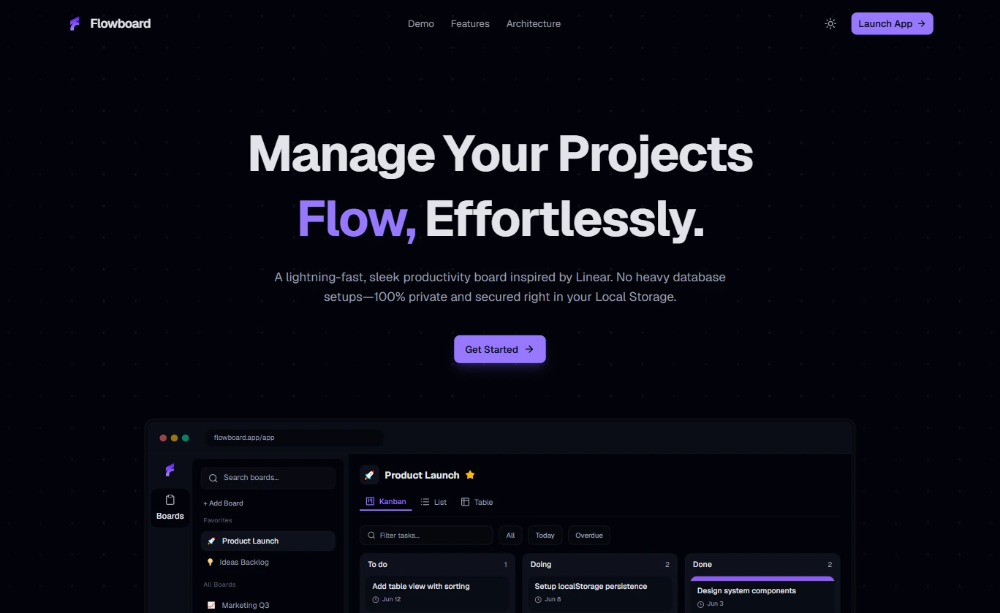
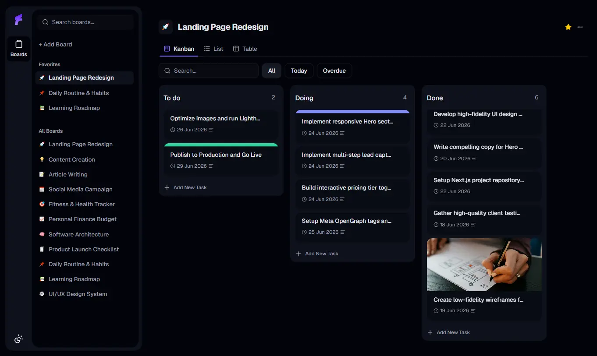
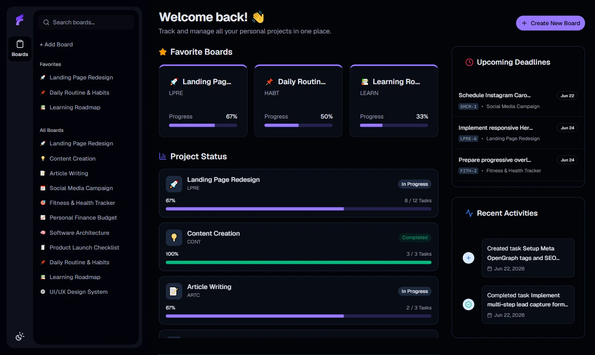

<div align="center">
  
  
  # 🚀 Flowboard
  
  **A lightweight productivity app that empowers you to organize workflows seamlessly through versatile task boards, operating entirely via local storage for maximum speed.**
  
  [](https://nextjs.org/)
  [](https://www.typescriptlang.org/)
  [](https://tailwindcss.com/)
  [](https://ui.shadcn.com/)
</div>

<br />

<div align="center">
  
  <br />
  
  <br />
  
</div>

---

## ⚡ Main Philosophy: Local-First & Zero Latency
Unlike traditional task management applications that rely on constant server communication, **Flowboard** is intentionally architected to be a **local-first** system. 

- **Privacy by Default**: Your boards, descriptions, and tasks stay inside your browser. No third-party servers or databases.
- **Zero Latency**: State updates occur instantly on the client, with data saved synchronously using browser `localStorage`.
- **Dynamic Routing**: Built with Next.js dynamic routing (`/app/[boardId]`) so your boards are fully shareable, bookmarkable, and reload-proof.

---

## 🖥️ Application Structure
Flowboard is designed with two distinct interfaces to separate public-facing presentation from the actual productivity workspace.

1. **Landing Page (`/`)**
   The entry point of the application. Designed to be a beautiful marketing page that introduces the core value of Flowboard before the user enters the workspace.
   
2. **The App Workspace (`/app`)**
   The core productivity engine. This consists of:
   - **Dashboard (`/app`)**: An overview featuring "Project Status", "Upcoming Deadlines", and "Recent Activity" widgets.
   - **Board View (`/app/[boardId]`)**: The dedicated workspace for individual boards, equipped with multiple dynamic task views.

---

## ✨ Features (Based on Deep Code Analysis)
The application is built with a highly structured React Reducer engine to handle complex states safely without external libraries.

- **🗂️ Multi-Board Management**: Create, edit, and organize multiple independent boards seamlessly.
- **🎛️ 3 Dynamic Board Views**: Instantly toggle between different visualization modes:
  - **Kanban View**: A classic drag-and-drop board powered by `@dnd-kit`.
  - **List View**: A structured, vertical layout for quick scanning.
  - **Table View**: A dense data grid interface powered by `@tanstack/react-table`.
- **🎯 Advanced Task Handling**: 
  - Assign task statuses and set priority levels.
  - Pick due dates using the built-in Calendar widget.
  - Visually distinguish tasks with beautiful cover images.
  - Safe data input strictly validated using `react-hook-form` and `zod`.
- **🌗 Premium Aesthetics & Dark Mode**: A meticulously crafted UI using `shadcn/ui` components and Tailwind CSS v4, complete with a seamless Light/Dark mode toggle.

---

## 🛠️ Built With

| Tech Stack | Purpose | Rationale |
| :--- | :--- | :--- |
| **Next.js 16** | Core framework | App router support, optimization, and robust dynamic routing paths. |
| **React 19** | Rendering & state | Client state architecture powered by standard React hooks and Reducers. |
| **Tailwind CSS v4** | Styling system | Fast utilities, optimized performance, and modern CSS variables engine. |
| **TypeScript** | Static typing | Complete type safety, discriminated union state actions, and self-documenting code. |
| **shadcn/ui** | Component library | Beautifully designed, accessible components for a premium user experience. |
| **@dnd-kit & TanStack** | Advanced UI | Drag-and-drop primitives and headless tables for complex data views. |

---

## 🚀 Getting Started

### Prerequisites
Make sure you have **Node.js** (v18+) and **npm** installed on your system.

### 1. Clone the Repository
```bash
git clone https://github.com/yossyadirta/flowboard.git
cd flowboard
```

### 2. Install Dependencies
```bash
npm install
```

### 3. Run the Development Server
```bash
npm run dev
```
Open [http://localhost:3000](http://localhost:3000) in your browser to view the application.
